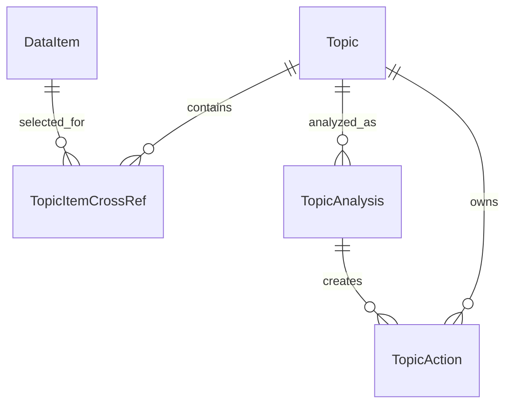

# SmartClipboard 아키텍처

## 기준 구조

SmartClipboard는 Kotlin + Jetpack Compose 기반 Android 앱입니다. 구조는 MVVM을 기준으로 나눕니다.

- `domain`: 핵심 모델, repository interface, use case 성격의 계약
- `data`: Room entity, DAO, repository 구현, Android data source, enrichment processor
- `presentation`: Activity, ViewModel, Compose 화면
- `di`: Hilt module과 dispatcher 주입
- `ui/theme`: 앱 테마와 색상 토큰

## MVVM 역할

- Activity는 Android lifecycle, permission launcher, intent 진입점을 담당합니다.
- ViewModel은 UI 상태와 사용자 intent를 처리합니다.
- Repository는 저장, 조회, 수집 결과 반영, Topic/Action 흐름의 facade 역할을 합니다.
- DataSource/Processor는 Android API, OCR, OG 추출, Gemini 호출처럼 외부 시스템과 맞닿은 기능을 담당합니다.
- Compose 화면은 상태를 렌더링하고 event를 ViewModel intent로 전달합니다.

## DataRepository 중심 데이터 흐름

`DataRepository`는 앱 안의 자료 흐름을 모으는 중심 facade입니다.

주요 책임:

- `DataItem` 저장 및 관찰
- Share/Tile/MediaStore/SAF로 들어온 데이터 저장
- OCR/OG/Gemini enrichment 결과 반영
- Topic 생성 및 DataItem 연결
- TopicAnalysis 생성 및 관찰
- TopicAction 초안 생성 및 상태 갱신
- 외부 앱 전송 결과 반영

단, `DataRepositoryImpl`이 모든 책임을 직접 가지면 커집니다. 구현 단계에서는 facade는 유지하되 내부 collaborator를 기능별로 분리합니다.

권장 collaborator:

- `ShareContentHandler`
- `ClipboardCaptureHandler`
- `MediaSyncManager`
- `SafImportHandler`
- `DataItemEnrichmentManager`
- `WebExtractor`
- `OcrProcessor`
- `GeminiManager`
- `ClusterManager`
- `TopicPlanner`
- `TopicActionGenerator`
- `SamsungExportManager`

## 모델 관계

### DataItem / DataItemEntity

모든 수집 데이터의 기본 단위입니다. MVP에서는 아래 계열 필드를 검토합니다.

- type: TEXT, LINK, IMAGE, SCREENSHOT, DOWNLOAD_IMAGE, FILE
- content: 텍스트, URL, MediaStore URI, 내부 복사 URI
- source: share, clipboard_tile, mediastore, saf
- enrichmentStatus: PENDING, PROCESSING, DONE, FAILED
- ocrText, ogTitle, ogDescription, ogImageUrl
- geminiSummary, keywords, detectedDateTime, detectedLocation
- clusterId, clusterLabel, clusterScore, clusterUpdatedAt
- isImportant, isPreserved

`T-030` 기준으로 domain model은 enum과 nested value object를 사용하고, Room Entity는 schema 안정성을 위해 enum을 문자열 column으로 저장합니다.

- Domain: `DataItem`, `DataItemStorage`, `DataItemEnrichment`, `DataItemCluster`
- Entity: `DataItemEntity`
- Mapper: `DataItem <-> DataItemEntity`
- 중요 필드: `type`, `source`, `sourceUri`, `internalUri`, `capturedAtMillis`, `lastSyncedAtMillis`, `mediaStoreId`, `enrichmentRetryCount`, `deletedAtMillis`

### Topic

사용자가 확정한 작업 단위입니다. AI 추천은 임시 후보이며 사용자 수락 전에는 Topic으로 영구 저장하지 않습니다.

`T-030` 기준 Topic은 origin badge와 완료 상태를 직접 보존합니다.

- `TopicOrigin`: `USER_REQUEST`, `AI_RECOMMENDATION`, `SYSTEM_SUGGESTION`
- `TopicStatus`: `ACTIVE`, `COMPLETED`, `INCOMPLETE`, `ARCHIVED`
- AI 추천은 이번 실행의 임시 후보로 두며, 사용자가 확인/수락한 경우에만 `Topic`으로 저장합니다.

### TopicAnalysis

Topic 자료를 분석한 결과입니다. Summary/Calendar/TODO 초안 생성의 근거가 됩니다.

`T-030` 기준 `TopicAnalysis`는 분석 상태, 요약, 근거 목록, 모델명, 실패 사유, retry count를 가집니다.

### TopicAction

사용자가 검토할 실행 초안입니다. MVP에서는 `SUMMARY`, `CALENDAR`, `TODO`를 우선합니다. Reminder와 Notes 전송 payload는 TopicAction에서 파생합니다.

`T-030` 기준 `TopicAction`은 외부 앱으로 바로 실행되지 않는 reviewable payload입니다.

- `TopicActionType`: `SUMMARY`, `NOTE`, `CALENDAR`, `REMINDER`, `TODO`
- `TopicActionTargetApp`: `NONE`, `SAMSUNG_NOTES`, `SAMSUNG_CALENDAR`, `SAMSUNG_REMINDER`, `SYSTEM_CALENDAR`
- `TopicActionStatus`: `PENDING_REVIEW`, `IN_PROGRESS`, `COMPLETED`, `INCOMPLETE`, `EXPORTED`, `DISMISSED`
- Calendar payload는 title/body/location/start/end/all-day를 보존합니다.
- Notes/Reminder payload는 title/body/previewText를 기준으로 Samsung export task에서 변환합니다.

## Room 역할

- `DataItemEntity`, `TopicEntity`, `TopicItemCrossRefEntity`, `TopicAnalysisEntity`, `TopicActionEntity` 저장
- schema 변경은 공통 기반 task로 순차 처리
- migration 없이 DB schema를 바꾸지 않음
- 자동 추천 후보는 원칙적으로 영구 테이블에 쌓지 않음

`T-030` 기준 Room database는 `SmartClipboardDatabase` version `1`입니다. 아직 새 repository에 migration/schemas 운영 방식이 확정되지 않았으므로 `exportSchema = false`로 시작하고, 첫 배포 또는 CI 기준이 생기면 schema export task를 별도로 승인받아 처리합니다.

주요 DAO:

- `DataItemDao`
- `TopicDao`
- `TopicAnalysisDao`
- `TopicActionDao`

Repository 계약:

- `DataRepository`
- `DataRepositoryImpl`

`DataRepositoryImpl`은 facade의 시작점만 제공합니다. Share/Tile/MediaStore/SAF, OCR/OG/Gemini, storage cleanup 세부 책임은 후속 task에서 collaborator로 분리합니다.

## Hilt 역할

- Repository, Handler, Processor, Manager, CoroutineDispatcher 주입
- Gemini API key는 `local.properties -> BuildConfig`로 주입
- 새 module 추가는 충돌 위험이 있으므로 task 문서에 명시

`T-100` 기준 실제 앱 저장 경로를 위해 아래 module을 추가했습니다.

- `DatabaseModule`: `SmartClipboardDatabase`와 DAO 제공
- `RepositoryModule`: `DataRepositoryImpl`을 `DataRepository`로 바인딩
- `ProcessingModule`: `RoomDataItemEnrichmentStore`, `JsoupWebExtractor`, `MlKitOcrProcessor`, `DataItemEnrichmentTrigger` 바인딩

`T-140` 기준 enrichment 처리는 `DataRepositoryImpl`에 직접 붙이지 않고 별도 collaborator로 분리했습니다.

- `DataItemEnrichmentManager`: pending DataItem을 읽어 OG/OCR 처리, retry/failed 상태 갱신
- `RoomDataItemEnrichmentStore`: `DataItemDao.getPendingForEnrichment()`와 `DataItemDao.update()`를 사용해 전처리 상태를 저장
- `OpenGraphMetadataParser`: OG/Twitter/meta description을 파싱하고 상대 이미지 URL을 절대 URL로 변환
- `JsoupWebExtractor`: Jsoup 네트워크 작업을 `Dispatchers.IO`에서 실행
- `MlKitOcrProcessor`: ML Kit Korean Text Recognition으로 content URI OCR 수행
- `DataItemEnrichmentTrigger`: Share/Clipboard/MediaStore/SAF 저장 성공 후 최대 3개 항목을 2초 timeout 안에서 시도

`T-150` 기준 Gemini 추천은 사용자 수락 전 영구 저장하지 않습니다.

- `GeminiTopicRecommendationManager`: 현재 DataItem을 입력으로 이번 실행 추천 세션 생성
- `InMemoryRecommendationSessionStore`: 앱 프로세스 안의 최신 추천 세션만 유지하고 새 추천이 오면 교체
- `GeminiRecommendationPromptBuilder`: 세부 실행 버튼이 아니라 `최근 자료 정리`, `새 자료 다시 보기`, `AI 다시 분석` 같은 흐름형 추천을 요청
- `HttpGeminiTextClient`: `BuildConfig.GEMINI_API_KEY`로 주입된 key를 사용해 Gemini REST `generateContent` 호출
- `GeminiRecommendationParser`: 모델 응답 JSON을 `TopicRecommendationCandidate`로 변환
- key가 비어 있거나 호출에 실패해도 Home 흐름이 깨지지 않도록 `SKIPPED` 또는 `FAILED` 세션으로 남깁니다.

## Coroutines 역할

- Room, MediaStore, 파일 복사, Jsoup OG 추출, OCR, Gemini 호출은 IO dispatcher에서 실행
- UI 상태 갱신은 ViewModel scope에서 처리
- 자동 분석은 홈 렌더링을 막지 않는 별도 job/state로 관리
- 실패한 OCR/OG/Gemini 작업은 최대 3회 retry 후 pending/failed 상태로 남기고 다음 앱 실행 또는 사용자의 재분석 액션에서 재시도

## Compose 역할

- Home, Inbox, Logs, Settings, Topic/Action 상세 화면을 분리
- 대형 단일 화면 파일을 피하고 화면/컴포넌트 단위로 분리
- 기능이 많아도 기본 화면은 ChatGPT/Codex처럼 단순한 작업 시작/재개 경험을 유지

## Navigation 기준

`T-040` 기준 root navigation은 `presentation/navigation`에 둡니다.

- `AppRoute`: route 문자열 계약
- `TopLevelDestination`: bottom tab 계약
- `SmartClipboardRoot`: 앱 root scaffold

Top-level tab:

- `home`
- `inbox`
- `logs`
- `settings`

Detail route:

- `topic/create`
- `topic/{topicId}/select`
- `topic/{topicId}/analysis`

현재는 후속 작업의 충돌을 줄이기 위해 AndroidX Navigation graph를 확장하지 않고, top-level tab state와 route contract를 먼저 고정합니다. 기능 화면이 생기면 `AppRoute`의 문자열을 유지한 채 Navigation graph 또는 typed destination으로 확장합니다.

화면 shell:

- `HomeShellScreen`
- `InboxShellScreen`
- `LogsShellScreen`
- `SettingsShellScreen`
- `TopicCreateShellScreen`
- `TopicDataSelectionShellScreen`
- `TopicAnalysisShellScreen`

## Android 컴포넌트 역할

### MainActivity

앱의 메인 진입점입니다. MediaStore 자동 수집, 권한 요청, 탭 navigation, Settings 진입, 삼성 앱 export launcher를 연결합니다.

`T-120` 기준 구현 상태:

- 앱 실행 시 이미지 접근 권한을 확인합니다.
- 권한이 있으면 `MediaSyncManager.syncNewImages()`를 호출합니다.
- 권한이 없으면 Android runtime permission을 요청하고, 허용된 경우 sync를 시작합니다.

### MediaStore Image Sync

`T-120`에서 앱 실행 시 이미지 자동 수집 경로를 추가했습니다.

- `AndroidMediaStoreDataSource`: Last Sync Time 이후부터 현재 실행 시각까지 MediaStore 이미지 조회
- `SharedPreferencesMediaSyncCheckpointStore`: 마지막 sync 시각 저장
- `MediaImportHandler`: MediaStore 후보를 `DataItem`으로 저장
- `MediaSyncManager`: 조회, 저장, checkpoint 갱신을 조율
- 중복 기준: 기존 `mediaStoreId`, 기존 `sourceUri`, 같은 batch 내 후보 중복
- checkpoint 갱신: 저장 실패가 없을 때만 현재 실행 시각으로 갱신

### SAF File Picker

`T-130`에서 사용자가 직접 파일을 선택해 담는 Storage Access Framework 흐름을 추가했습니다.

- `SafPickedFileReader`: `ContentResolver`와 `OpenableColumns`로 선택 URI metadata 조회
- `SafImportHandler`: 선택 파일을 `DataItemSource.SAF`로 저장
- 저장 type: `image/*`는 `IMAGE`, 그 외는 `FILE`
- 중복 기준: 기존 `sourceUri`, 같은 batch 내 URI 중복
- UI 진입점: Inbox shell의 작은 `파일 추가` 버튼

### ShareReceiverActivity

Android Share Sheet에서 SmartClipboard를 선택했을 때 실행됩니다. 링크/텍스트/이미지/파일을 받고 짧은 저장 피드백을 보여준 뒤 종료합니다. 링크는 1~2초만 OG 추출을 기다리고 늦으면 다음 분석 흐름으로 넘깁니다.

`T-100` 기준 구현 상태:

- `ShareIntentReader`: `ACTION_SEND`, `ACTION_SEND_MULTIPLE`, `EXTRA_TEXT`, `EXTRA_STREAM`을 `SharePayload`로 변환
- `ShareContentHandler`: `SharePayload`를 `DataItem`으로 변환해 `DataRepository`에 저장
- 저장 결과: `Success`, `PartialSuccess`, `Failure`
- 사용자 피드백: `SmartClipboard에 담았어요`, `일부만 담았어요`, `저장하지 못했어요`
- `T-140` 기준 저장 성공 후 `DataItemEnrichmentTrigger`가 링크 OG/이미지 OCR을 짧게 시도하며, timeout은 retry 실패로 세지 않습니다.

### ClipboardCaptureTileService

Quick Settings Tile 진입점입니다. TileService에서 클립보드를 직접 읽지 않고 `ClipboardCaptureActivity`를 엽니다.

`T-110` 기준 구현 상태:

- Tile 클릭 시 `ClipboardCaptureActivity`를 실행하고 Quick Settings 패널을 접습니다.
- Android 14 이상은 `PendingIntent` 기반 `startActivityAndCollapse`를 사용합니다.
- 이전 Android 버전은 Intent overload로 fallback합니다.

### TransparentActivity / ClipboardCaptureActivity

투명 Activity로 잠시 foreground/focus를 얻은 뒤 Primary Clip 1개를 읽어 저장합니다. 저장 후 `SmartClipboard에 담았어요` 같은 짧은 피드백을 보여주고 종료합니다.

`T-110` 기준 구현 상태:

- window focus를 얻은 뒤 Primary Clip을 한 번만 읽습니다.
- 텍스트/링크만 `DataItemSource.CLIPBOARD_TILE`로 저장합니다.
- 빈 클립보드, 미지원 clip, 저장 실패를 조용한 Toast로 안내합니다.
- 백그라운드 감시 또는 클립보드 히스토리 접근은 구현하지 않았습니다.
- `T-140` 기준 저장 성공 후 `DataItemEnrichmentTrigger`가 pending 링크 OG 추출을 짧게 시도합니다.

## T-000 코드 감사 결과

감사 일자: 2026-05-27

### 로컬 작업공간 상태

`T-000` 감사 시점에는 `C:\Users\user\workspace\SmartClipboardAI`가 Git repository가 아니었고 Android 앱 코드도 없었습니다. 로컬에는 `AGENTS.md`, `docs/`, `.github/pull_request_template.md`만 존재했습니다.

따라서 구현 시작은 기존 코드를 수정하는 방식이 아니라, 참고 GitHub 초안에서 필요한 구조를 선별해 새 로컬 Android 프로젝트 기반을 구성하는 방식으로 진행했습니다. `T-020-architecture-baseline`에서 Android Studio 프로젝트 골격, Gradle, package namespace, Hilt/Room/Compose 기준을 먼저 잡았습니다.

### 참고 GitHub 초안에서 읽은 주요 파일

- `README.md`
- `settings.gradle.kts`
- `build.gradle.kts`
- `gradle/libs.versions.toml`
- `app/build.gradle.kts`
- `app/src/main/AndroidManifest.xml`
- `app/src/main/java/com/samsung/smartclipboard/domain/model/DataItem.kt`
- `app/src/main/java/com/samsung/smartclipboard/domain/model/DataItemType.kt`
- `app/src/main/java/com/samsung/smartclipboard/domain/model/Topic.kt`
- `app/src/main/java/com/samsung/smartclipboard/domain/model/TopicAnalysis.kt`
- `app/src/main/java/com/samsung/smartclipboard/domain/model/TopicAction.kt`
- `app/src/main/java/com/samsung/smartclipboard/data/model/DataItemEntity.kt`
- `app/src/main/java/com/samsung/smartclipboard/data/source/local/SmartClipboardDatabase.kt`
- `app/src/main/java/com/samsung/smartclipboard/data/source/local/DataItemDao.kt`
- `app/src/main/java/com/samsung/smartclipboard/domain/repository/DataRepository.kt`
- `app/src/main/java/com/samsung/smartclipboard/data/repository/DataRepositoryImpl.kt`
- `app/src/main/java/com/samsung/smartclipboard/data/source/share/AndroidShareContentHandler.kt`
- `app/src/main/java/com/samsung/smartclipboard/presentation/share/ShareReceiverActivity.kt`
- `app/src/main/java/com/samsung/smartclipboard/data/source/clipboard/DefaultClipboardCaptureHandler.kt`
- `app/src/main/java/com/samsung/smartclipboard/presentation/clipboard/ClipboardCaptureActivity.kt`
- `app/src/main/java/com/samsung/smartclipboard/data/source/media/AndroidMediaStoreDataSource.kt`
- `app/src/main/java/com/samsung/smartclipboard/data/source/media/DefaultMediaImportHandler.kt`
- `app/src/main/java/com/samsung/smartclipboard/SourceExtractor.kt`
- `app/src/main/java/com/samsung/smartclipboard/GeminiManager.kt`
- `app/src/main/java/com/samsung/smartclipboard/GeminiClient.kt`
- `app/src/main/java/com/samsung/smartclipboard/AppDatabase.kt`
- `app/src/main/java/com/samsung/smartclipboard/presentation/main/MainActivity.kt`
- `app/src/main/java/com/samsung/smartclipboard/presentation/main/MainViewModel.kt`
- `app/src/main/java/com/samsung/smartclipboard/presentation/main/MainScreen.kt`
- `app/src/main/java/com/samsung/smartclipboard/presentation/handoff/HandoffDraftFormatter.kt`
- `app/src/main/java/com/samsung/smartclipboard/presentation/handoff/HandoffLauncher.kt`
- `app/src/main/java/com/samsung/smartclipboard/data/ai/HeuristicAiProposalGenerator.kt`
- `docs/manual-test-checklist.md`
- `docs/one-ui-palette.md`

### 유지할 구조

- README의 큰 데이터 흐름: `DataItem -> Topic -> TopicAnalysis -> TopicAction`
- MVVM + Room + Hilt + Coroutines + Compose 기반 구조
- `DataRepository`를 facade로 두고 Share/Tile/MediaStore/Topic/Action 흐름을 모으는 방향
- `DataItem`, `Topic`, `TopicAnalysis`, `TopicAction`의 기본 모델 방향
- `TopicItemCrossRefEntity`로 Topic과 DataItem을 연결하는 관계 구조
- `ShareReceiverActivity`와 `AndroidShareContentHandler`의 Share Target 처리 골격
- `ClipboardCaptureTileService -> ClipboardCaptureActivity -> ClipboardManager` 우회 구조
- `AndroidMediaStoreDataSource`의 API 버전별 이미지 권한 분기
- `HandoffDraftFormatter`, `HandoffLauncher`의 초안 생성/Intent 실행 아이디어
- `one-ui-palette.md`의 절제된 Samsung blue palette
- `manual-test-checklist.md`의 수동 QA 시나리오 구조
- ExportContents 참고 코드의 Notes/Calendar/Reminder intent 분리 방식

### 수정해서 가져갈 구조

- `DataItem`/`DataItemEntity`: 현재는 최소 필드만 있으므로 enrichment, retry, cluster, importance, preserve, sync 정보를 추가해야 합니다.
- `DataItemType`: `DOWNLOAD_IMAGE` 또는 source 기반 subtype 구분이 필요합니다.
- `SmartClipboardDatabase`: Topic/Analysis/Action 구조는 참고하되 새 schema는 처음부터 MVP 필드에 맞춰 재정의합니다.
- `DataRepositoryImpl`: facade 방향은 좋지만 현재 구현은 저장, 추천, 분석, action 생성이 한 파일에 몰려 있습니다. 내부 collaborator로 분리합니다.
- `AndroidShareContentHandler`: MIME/URI 처리와 내부 복사 골격은 참고합니다. 단, 모든 공유 파일을 무조건 내부 복사하는 방식은 hybrid storage 정책에 맞게 바꿉니다.
- `DefaultClipboardCaptureHandler`: 최신 Primary Clip 1개 저장 구조는 유지합니다. 사용자 문구와 중복 방지 정책은 새 UX 톤에 맞춥니다.
- `AndroidMediaStoreDataSource`: 현재는 최근 media limit 기반 조회입니다. MVP에서는 Last Sync Time 기준 모든 새 이미지를 batch query해야 합니다.
- `DefaultMediaImportHandler`: 현재는 screenshot만 import합니다. MVP에서는 모든 새 이미지를 수집하고 screenshot/download/camera 여부를 metadata로 분류합니다.
- `SourceExtractor`: Jsoup/ML Kit 사용 방향은 유지합니다. URL 처리는 본문 전체 추출보다 OG tag 추출과 timeout/retry 중심으로 재작성합니다.
- `GeminiClient`: structured JSON 출력 아이디어는 참고합니다. key 관리, 모델명, 오류 처리, response parsing은 새로 정리합니다.
- `HandoffLauncher`: Calendar insert intent는 참고합니다. Notes/Reminder는 ExportContents 방식처럼 삼성 package 명시와 Manifest `<queries>`를 추가합니다.
- `MainViewModel`: 사용자 intent를 ViewModel로 모으는 방향은 참고합니다. Home/Inbox/Logs/Settings/Topic/Analysis별 ViewModel로 분리합니다.

### 버리거나 새로 작성할 구조

- `GeminiManager`의 하드코딩된 Gemini API key는 절대 이식하지 않습니다. 새 프로젝트에서는 `local.properties -> BuildConfig` 또는 안전한 로컬 설정으로만 주입합니다.
- `AppDatabase.kt`의 `KnowledgeEntity` 계열은 `SmartClipboardDatabase`와 별개인 실험 코드입니다. 새 Room schema에 그대로 합치지 않습니다.
- `AiProposalEntity` 영구 저장 구조는 MVP 원칙과 맞지 않습니다. AI 추천은 이번 실행의 임시 추천으로 두고, 사용자가 확인/수락한 것만 Topic/Logs에 남깁니다.
- `HeuristicAiProposalGenerator`는 임시 휴리스틱입니다. Gemini 기반 추천 전까지 테스트 fake로만 참고하고, 사용자에게 AI 분석처럼 보이게 하지 않습니다.
- `MainScreen.kt` 대형 단일 화면 구조는 유지하지 않습니다. Home, Inbox, Logs, Settings, Topic, Analysis 화면 단위로 분리합니다.
- 기존 UI의 데이터 리스트 중심 Dashboard는 새 UX 방향과 맞지 않습니다. Home은 작업 시작/재개 중심으로 다시 만듭니다.
- Calendar draft가 항상 현재 시각 +1시간으로 열리는 fallback은 MVP 품질에 맞지 않습니다. AI/사용자 검토 payload의 실제 시간 필드를 사용해야 합니다.

### 기술 위험

- 참고 초안의 `app/build.gradle.kts`는 `compileSdk = 36`, `targetSdk = 36`, 일부 최신 dependency를 사용했습니다. `T-020`에서 현재 Android Studio/SDK 환경과 Gradle sync 호환성을 확인했고, 새 baseline은 `compileSdk = 35`, `targetSdk = 35`, AGP `8.7.3` 기준으로 고정했습니다.
- 참고 초안은 `kotlinx-serialization` plugin 버전이 Kotlin plugin 버전과 다르게 선언되어 있습니다. 새 baseline에서 version catalog로 일관화합니다.
- 참고 초안은 Room `exportSchema = false`입니다. 협업과 migration 추적을 위해 새 프로젝트에서는 schema export 여부를 다시 결정합니다.
- 링크 OG/OCR/Gemini 실패 재시도 모델이 아직 없습니다. `T-140`에서 retry count와 status를 DB 계약에 포함해야 합니다.
- Share/Media import가 내부 저장소를 빠르게 늘릴 수 있습니다. `T-160` storage quota 정책과 함께 구현해야 합니다.

### T-020 baseline 결과

`T-020-architecture-baseline`에서 새 Android 앱 baseline을 생성했습니다.

- Root project name: `SmartClipboardAI`
- App display name: `SmartClipboard`
- Package, namespace, applicationId: `com.smartclipboard.ai`
- Gradle wrapper: `8.10.2`
- Android Gradle Plugin: `8.7.3`
- Kotlin: `2.0.21`
- compileSdk / targetSdk / minSdk: `35 / 35 / 26`
- 기본 stack: Kotlin, Jetpack Compose, Hilt, Room, Coroutines/Flow
- Gemini API key: `local.properties`의 `gemini.api.key`를 `BuildConfig.GEMINI_API_KEY`로 주입하며 source에는 하드코딩하지 않음
- `local.properties`는 `.gitignore` 대상이며 새 repository에 commit하지 않음
- 현재 Manifest는 launcher Activity만 포함한 최소 상태이며, Share Target, TileService, TransparentActivity, Samsung app `<queries>`, Android 권한은 `T-050-permission-and-manifest-baseline`에서 순차적으로 다룸

처음 빌드 시 최신 AndroidX 버전이 `compileSdk 36`과 AGP `8.9.1` 이상을 요구해 실패했습니다. 현재 설치된 Android Studio/SDK 환경에 맞춰 `compileSdk 35 + AGP 8.7.3`과 호환되는 AndroidX 버전으로 고정했고, `assembleDebug`와 `test`가 통과했습니다.

## 충돌 위험과 작업 순서

공통 모델, DB, Repository, Navigation, Theme, Manifest, Gradle은 병렬 수정 금지 영역입니다.

권장 순서:

1. 현재 코드 감사 및 재사용 후보 확정
2. 공통 모델/DB/Repository baseline
3. Permission/Manifest baseline
4. Navigation/tabs baseline
5. 수집 흐름 안정화
6. enrichment/OCR/OG/Gemini pipeline
7. Home/Inbox/Logs/Settings UX
8. Topic/Action/Samsung export
9. QA와 문서 정리
